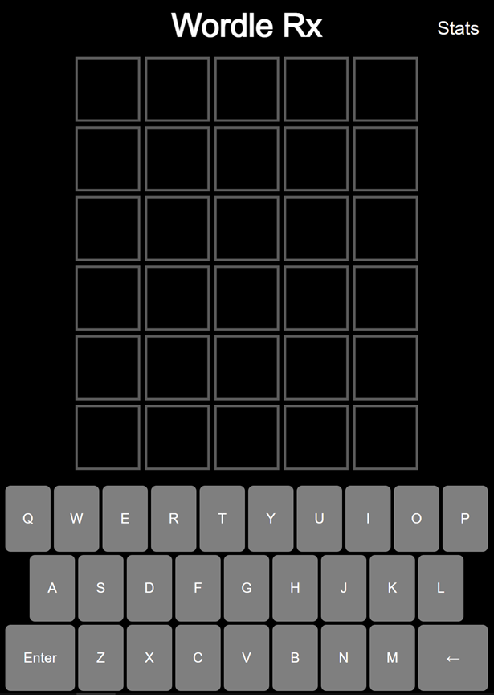

# Wordle Rx

## Table of Contents

- [Wordle Rx](#wordle-rx)
  - [Table of Contents](#table-of-contents)
  - [Description](#description)
    - [Display](#display)
      - [GUI](#gui)
    - [Folder structure](#folder-structure)
    - [Programming language(s)](#programming-languages)
  - [Installation](#installation)
  - [Usage](#usage)
    - [Invokation](#invokation)
    - [Operation](#operation)
  - [Contributions](#contributions)

## Description

This program allows for playing the popular [Wordle](https://www.nytimes.com/games/wordle/index.html) game where the answers (repeated weekly) are seven common medical/pharmacy terms for National Pharmacy Week!  
Start date: August 23, 2022  
Current version: 1.0.0  

### Display

#### GUI

### Folder structure

| Tree with Root Having Local Path | Generation Method | Description |
| -------------------------------- | ----------------- | ----------- |
| <https://github.com/anderjef/Wordle-Rx> | auto-generated by Processing | <!-- --> |

### Programming language(s)

- p5.js (JavaScript)
  - [sketch.js](sketch.js)&mdash;main program entrance containing all pertinent code

## Installation

1. p5.js Web Editor
    - Go to <https://editor.p5js.org/> and open a new sketch.
    - Either create the directory structure as seen under the root folder <https://github.com/anderjef/Wordle-Rx> then copy the content of each file to the respectively named file in the new sketch, or delete the starter index.html and sketch.js then download [ZIP](https://github.com/anderjef/Wordle-Rx/archive/main.zip) then upload the (JavaScript, CSS, and HTML) files from the root folder.

## Usage

### Invokation

1. Method 1&mdash;p5.js in web browser
    - Open <https://anderjef.github.io/Wordle-Rx/>.
2. Method 2&mdash;p5.js Web Editor
    - See [Installation](#installation).

### Operation

Type letters or use the provided on-screen keyboard to append to the current guess, use backspace to correct errors, and press enter or return to submit a guess, looking to match the answer. Hints are provided for submitted guesses where green indicates a letter found in the correct location as the answer while yellow indicates a matching letter in the solution that is found at a different position in the word. Share your game by having it copied to the device's clipboard.

## Contributions

- Jeffrey Andersen&mdash;developer
- <https://www.nytimes.com/games/wordle/index.html>&mdash;inspiration
- <https://www.quordle.com/>&mdash;inspiration
- <https://raw.githubusercontent.com/tabatkins/wordle-list/main/words>&mdash;valid words.txt
- <https://www.codegrepper.com/code-examples/html/p5.js+copy+value+to+clipboard>&mdash;writing to clipboard
