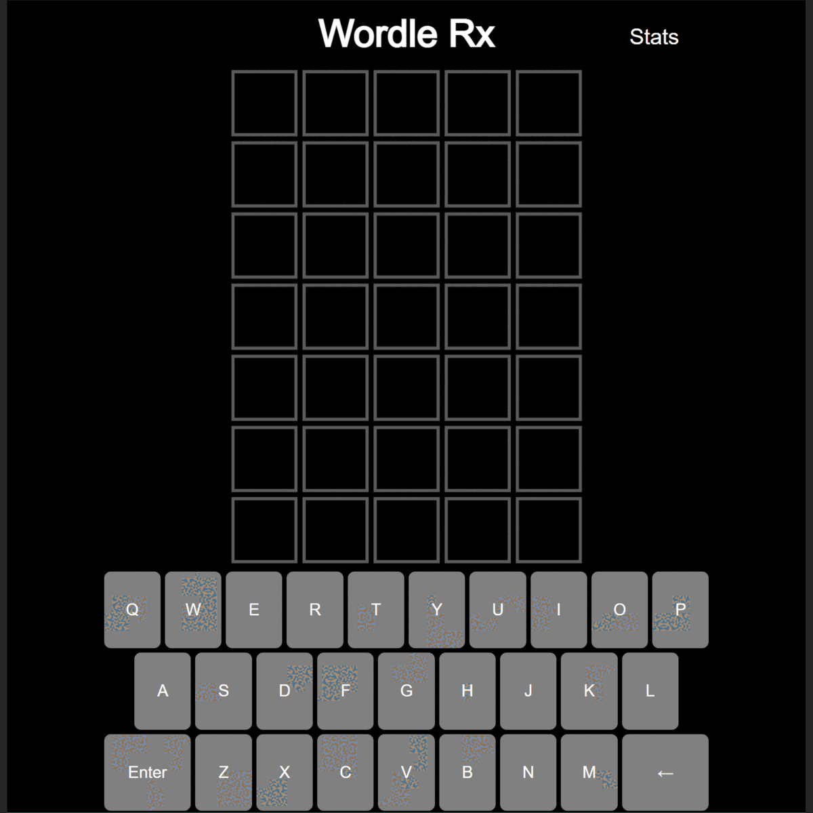

# Wordle Rx

## Table of Contents

- [Wordle Rx](#wordle-rx)
  - [Table of Contents](#table-of-contents)
  - [Description](#description)
    - [Display](#display)
      - [GUI](#gui)
    - [Folder structure](#folder-structure)
    - [Programming language(s)](#programming-languages)
  - [Usage](#usage)
    - [Invokation](#invokation)
    - [Operation](#operation)
  - [Contributions](#contributions)

## Description

This program allows for playing the popular [Wordle](https://www.nytimes.com/games/wordle/index.html) game where the answers (repeated weekly) are seven common medical/nursing terms for National Nurses Week and seven common medical/pharmacy terms for National Pharmacy Week!  
Start date: 2022-08-23  

### Display

#### GUI

The black is the provided display area.

### Folder structure

| Tree with Root Having Local Path | Generation Method | Description |
| -------------------------------- | ----------------- | ----------- |
| <https://github.com/anderjef/Wordle-Rx> | Processing | <!-- --> |

### Programming language(s)

- JavaScript
  - [sketch.js](sketch.js)&mdash;main program entrance containing all pertinent code

## Usage

### Invokation

Visit <https://anderjef.github.io/Wordle-Rx/>.

### Operation

Type letters or use the provided on-screen keyboard to append to the current guess, use backspace to correct errors, and press enter or return to submit a guess, looking to match the answer. Hints are provided for submitted guesses where green indicates a letter found in the correct location as the answer while yellow indicates a matching letter in the solution that is found at a different position in the word. Share your game by copying it to your device's clipboard.

## Contributions

- Jeffrey Andersen&mdash;developer
- <https://www.nytimes.com/games/wordle/index.html>&mdash;inspiration
- <https://www.quordle.com/>&mdash;inspiration
- <https://raw.githubusercontent.com/tabatkins/wordle-list/main/words>&mdash;[valid words.txt](./valid%20words.txt)
- <https://www.codegrepper.com/code-examples/html/p5.js+copy+value+to+clipboard>&mdash;writing to clipboard
- <https://werxltd.com/wp/2010/05/13/javascript-implementation-of-javas-string-hashcode-method/>&mdash;generating a hash from a string
